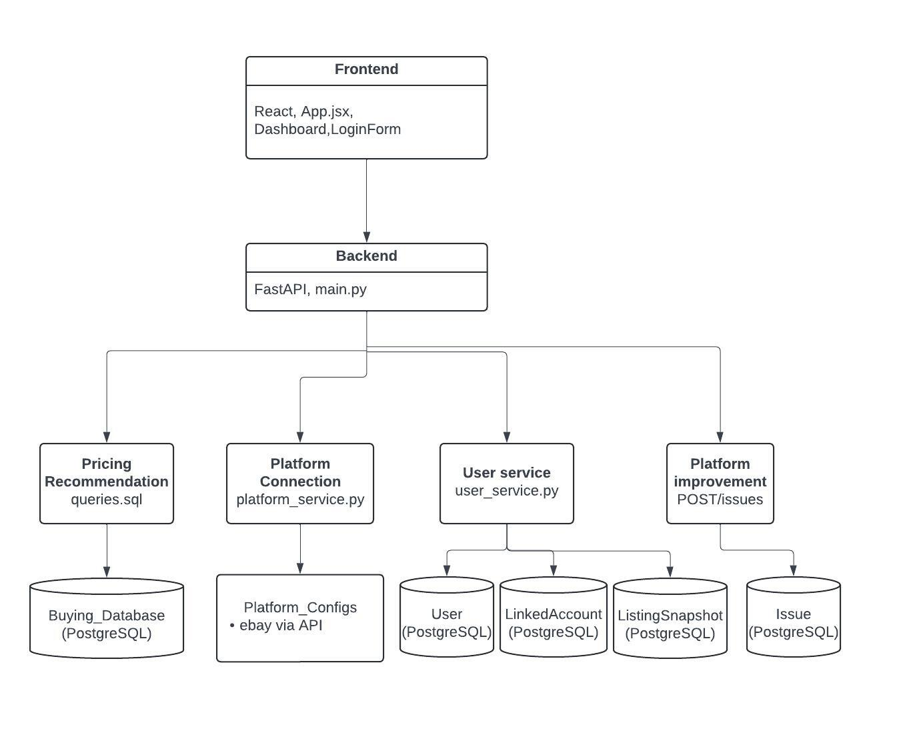
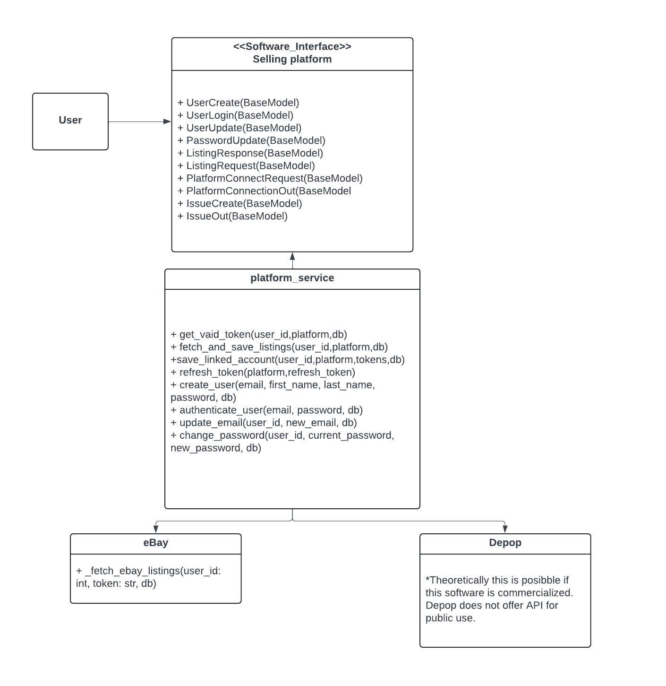
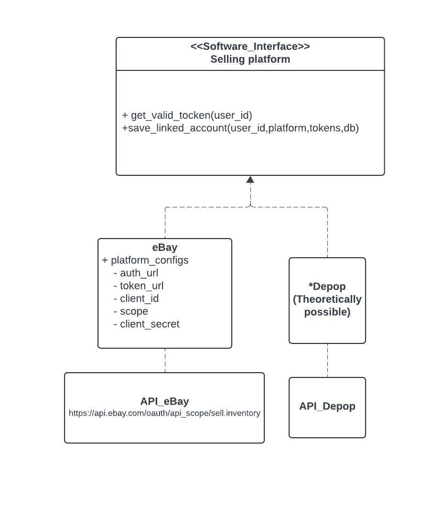

# Cross-platform Sale Intelligence Architecture

## Overview
* This file contains the description of the software architecture from three aspects - application architecture, structural design, and creational design. The system contains frontend, backend, and database component to create a comprehensive and user-friendly selling platform. 
---

## Design #1: Application Architecture - Modular Monolith
* Modular monolith is an architecture type that comprehends the "all-in-one" approach with a modular organization. It gives the developer the flexibility and scalability in developing a software. This architecture was selected because our team consists of students specialized in specific aspects within the software that lead to the modular development while aiming to develop a single product. It has allowed us to easily identify the code location by referring to the raw code it belongs to and organize the scripts. 
More information of the modular monolith architecture can be found [here](https://www.geeksforgeeks.org/system-design/what-is-a-modular-monolith/)

The overall diagram is as shown below: Currently, there are three major layers that make up this software. However, this structure will allow us to expand in a flexible manner due to clear organization. Any addition to the software will have a distinct location when it comes to code organization which will make the development efficient and effective.

* Frontend
This contains codes that is implemented to develop the frontend of the software. With applications of React App, we are able to develop a user interface that allows the sellers to have unified platform to manage their item listing across different selling platforms. This is where the user will interact with this software through the user interface.

* Backend
The backend mainly deals with the software's internal logic that ensures a smooth workflow in using this software. It manages the data retreived by different selling platform as well as management of the user information including user account creation, authentication, login. It also manages how any issues regarding the use of the software are managed internally. 

* Pricing Recommendation Database
This database incorporates the items listed on the platform in the PostgreSQL database. It allows sellers to manage item listing through flexible query options and reference pricing for pricing recommendation. 

* Platform Connection
Connections to each platform will be managed through the platform config. For this project, we were able to incorporate ebay. In the platform_service.py file, you will be able to find the section that includes the necessay information in order to connect the platform to ebay.

* User Service
User information is managed through two main databases using SQLite. First being the 'User' database. This is where we store user information such as user id, first name, last name, email, password, the date the account was created, linked accounts, and platform listing. Once the user information is incorporated, the user will be able to manage their own selling platform. Among the user information, the user is able to update their email and change their password in the future. The second database is 'LinkedAccount' database which manages external selling platform accounts that the user account has linkage to. This database stores information such as linkage id, platform name, access token, referesh token, token expiration, platform user id, date linkage was created, and user(cross platform sale) information.
---

## Design #2: Structural Design Pattern - Adapter Pattern
* Adapter pattern was selected due to the nature of this platform - retieving information from other selling platforms and implement them all to develop a comprehensive software with its own user interface. We will be retreiving information from different selling platforms without modifying thier source code but extracting necessary information to incude it to the UI of our platform. 
More information of the adapter pattern can be found [here](https://www.geeksforgeeks.org/system-design/adapter-pattern/).
The overall diagram is as shown below:

Explanation:
* The 'Target' here is the user interface of the cross-platform sale intelligence. The user (Client) will interact with this platform through the interface and perform activities such as user account creation, account information change, and platform management. 
In the background, there is an 'Adapter' for this interface that manages the information that was retrieved from the specific external selling platform through access token and also manages the cross-platform sale user information to allow the external platform information to be connected the designated user that owns the specific external platform account. 
The 'Adaptee' here are the external platforms that we incorporated/planned to incorporate. We successfully incorporated eBay to our platform and it collects information to list the eBay listing for the specific user in our platform. Depop was in the process of getting connected to our platform, but no public API was available. We have also reached out to Depop but no resource were available for public use. If this were to be commercialized, we will most likely be able to incorporate Depop to our platform as a business partnership. 

---

## Design #3: Creational Design Pattern - Factory Pattern
* Factory pattern was selected in implementing the the different selling platforms - eBay and  Depop. Each platform information will be retrieved from designated API, and it will give us the flexibility to add new products in each developmental step as well as in developing a tool that is user friendly.
More information about factory pattern can be found [here](https://www.geeksforgeeks.org/system-design/factory-method-for-designing-pattern/).

The overall diagram is as shown below:

Explanation:
* The interface is where the item information will be connected from different platforms. Each user will have a designated selling platform where their item listings will be available. 
* In connecting with the selling platforms, we used API keys to retrieve the information of interest. Specifically for eBay, we have developed a platform configuration that manages the access to the eBay platform that is tied to the user of interest. As mentioned prior, incorporating Depop was planned but was not available in the scope of this class project since they do not have publically available API for us to use. However, if this project expands to real-world application, our design pattern and strucutural organization will allow a smooth incorporation of this platform as well. 

